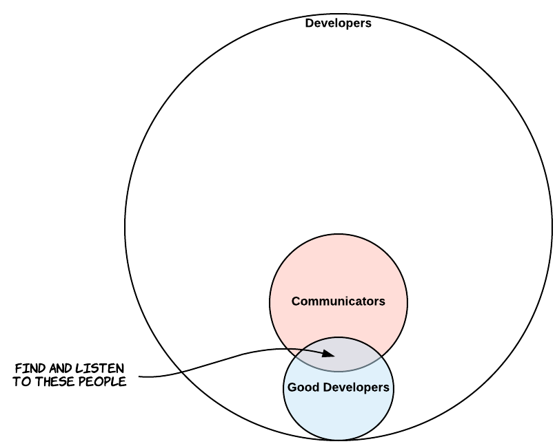

1. TOC
{:toc}

# Introduction

I'm about to start working on a new project, and thought it was time to really give my development environment a once-over. I'll be writing C++ and Python code to be executed onboard a small robotic platform, so I'm focusing on setting up a development environment for Linux from scratch.

Specifically, I'm looking for the following things:

* A [text editor](#editor), where I actually spend time writing my code;
* A [debugger](#debugger), so that I know what's wrong with my code without caveman-style printouts everywhere;
* [Visualization tools](#visualization), so that I can see my code at a higher level of abstraction;
* [Compiler tools](#compiler), so that I can easily generate build settings on the fly.

# Philosophical Points

It's very easy to find a quick answer to a question you might have (i.e., "What development environment should I use?"). The question isn't that simple, though, and it's not the only one. Philosophical guidelines both help guide you to the right questions as well as help you assess the answers to those questions.

The following are a few personal philosophical underpinnings that are completely biased. These drive my search for a solid development environment. Many of them contradict one-another (*Do I contradict myself? / Very well then, I contradict myself / (I am large, I contain multitudes)* - Walt Whitman, Song of Myself).

## If it doesn't work for me, it doesn't work
Whatever tools and setup I'm using, if I don't feel comfortable with them, I have two primary options: I can develop that comfortable feel for them, or I can simply not use them. For instance, I hate Eclipse. It was the first real IDE I've ever used, and really opened my eyes for what I can do with computers, but, even a decade ago it felt a decade behind. I've grown up using Apple products since I was 5, and I've gotten used to computers as more than just tools, but something beautiful with which to interact. If I'm going to spend most of my life staring at a computer, I want that computer to reflect some notion of aesthetic. Same idea for that computer's software.

I need a development environment that matches my notions of aesthetic and user-friendliness. You should examine your own personal philosophies: do you not care about how your interface looks, just so long as it works? Do you want the most bare-bones environment possible? Do you want to use whatever's familiar? These are all valid concerns, but nothing that the internet will answer for you.

## "The right tool for the right job" is bullshit
The notion that you need to use the right tool for the right job is a load of crap. Ideally, it's perfect -- of course you want to follow that rule; however, given the amount of tools available for any job, can you really justify that you're using the right tool? Are you going to do an exhaustive search over all possible text editors before writing a single line of code?

The rule that makes more sense to me is the following: "Try something. If it doesn't work, try something better." The focus on tool-driven development can hinder development itself. If you want to hang a painting, it's better to pound a nail into the wall with a heavy shoe than to spend all your energy searching for a nicer hammer, then falling asleep on the couch beside the unhung painting. Look for [affordances](https://en.wikipedia.org/wiki/Affordance), not tools.

## Don't trust yourself
The above points have a major flaw: if you get too comfortable with one set-up, you're not inclined to search for better alternatives. You need to experiment with other tools you might not like, and then see how much you *actually* like them. It's human nature to be resistant to change -- you need to recognize that in yourself and treat yourself like a test subject.

A byproduct is that you'll develop a familiarity with the possible tools you can use. If you try something and don't like it, you now have access to it in the future if you need to use it. For instance, I know I wasn't a huge fan of Eclipse, but if I'm going to start coding Java, then I'll probably give it another spin. Don't just throw away a tool because it didn't work once in one specific context - be flexible.

## Keep abstraction and pride separate
The most optimal software is as the assembly-level instructions that allow for direct control of hardware pins. The most optimal way to write software is to minimize the number of keyboard presses and mouse movements required to elicit the desired functionality. Obviously, these two are at odds.

My own preference is to start at higher levels of abstraction and work my way down based on what's creating bottlenecks. This means on a blank slate, I'll often start writing in Python, profile the code, look for ways that I can improve it in Python, then look for ways other languages could give me speedup. [Cython](http://cython.org/) is a great tool that supports this philosophy.

However, I've noticed people taking an alternate approach because of pride (i.e. writing C code for text processing, "Because it's faster".) There's a sense of pride in writing low-level code, but if pride's the main output of the code, then it's not code -- it's a self-awarded pat on the back. Writing optimized code takes away from other code you could be writing.

## Humans suck individually -- use the community
So you've been coding for a decade and you're better than most people you know. With [18M software developers as of 2014](https://www.infoq.com/news/2014/01/IDC-software-developers), you're almost certainly not the best in any one domain. More to the point, some people *are* the best in their domain -- or, at the very least, they're pretty damn good. From the subset of all developers, we get the good developers, and we'd like to find the intersection between these people and the developers who actually communicate their work.

*Definitely not to scale*

# Text Editors

## Terminal-based Editors

## Midrange Editors

## Integrated Development Environments

# Debuggers

# Visualization tools

# Compiler Tools
